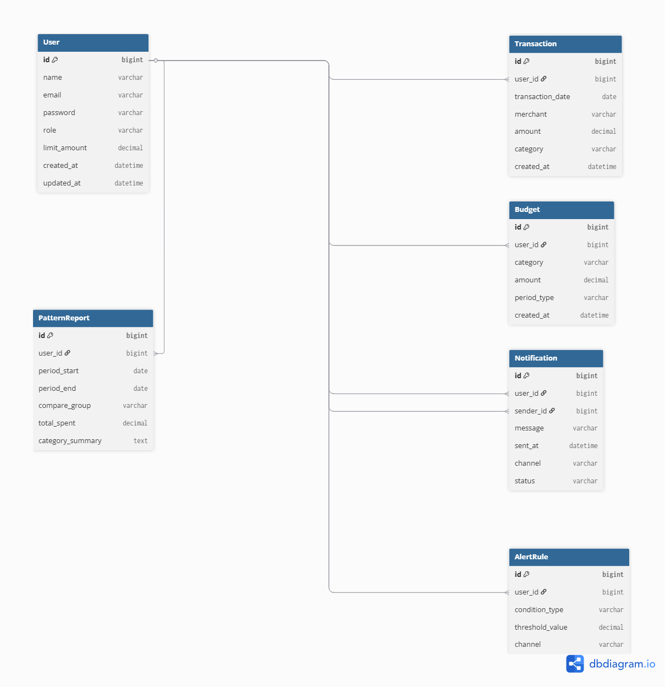

# 💳 신용카드 소비 분석 및 한도 초과 알림 서비스

---

## 1. 프로젝트 개요

- 사용자의 신용카드 사용 데이터를 등록하고 관리할 수 있는 백엔드 서비스입니다.
- 회원은 여러 신용카드를 발급받아 사용하고, 카드별 거래 내역과 캐시백 내역을 관리할 수 있습니다.
- 카드사는 `Company` 테이블로 관리되며, 카드 상품 정보(`Card`)를 제공합니다. (추가)
- 사용자는 카드별 한도 및 캐시백 정보를 확인할 수 있고, 관리자 역할은 사용자 지출 데이터 모니터링과 알림 발송을 담당합니다.
- 한도 초과 예상 시 스케줄러로 알림을 발송하며, 초과 시 실시간 알림을 제공합니다.
- 모든 알림은 Mailgun(이메일) 또는 SMS(Mock)으로 발송되며, 발송 주체는 관리자입니다.
- 모든 데이터는 REST API + Swagger UI로 테스트할 수 있습니다.

---

## 2 핵심 기능

| 번호 | 기능 | 설명 |
|------|------|------|
| 1 | 회원가입/로그인 | Spring Security + JWT 인증, ROLE_USER/ROLE_ADMIN 구분 |
| 2 | 신용카드 발급/관리 | `UserCard` 테이블을 통해 사용자는 여러 카드를 발급받아 사용 |
| 3 | 카드사/카드 상품 관리 | `Company` 및 `Card` 테이블로 카드사 정보와 카드 상품 관리 |
| 4 | 거래 내역 관리 | `Transaction` 테이블에 카드별 사용 내역 등록 |
| 5 | 캐시백 내역 관리 | `CashbackHistory` 테이블에 거래별 캐시백 발생 내역 관리 |
| 6 | 소비 패턴 분석 | `PatternReport` 테이블을 통해 주간/월간 소비 트렌드 제공 |
| 7 | 카테고리별 소비 목표 | `Budget` 테이블에서 목표 금액 관리 |
| 8 | 사용자별 한도 설정 | User.limit_amount 및 카드별 한도(`Card.limit_amount`) 관리 |
| 9 | 한도 초과/급등 알림 | `AlertRule` 기반 스케줄러/이벤트로 실시간 알림 발송 |
| 10 | Notification 기록 관리 | 발송 이력(`Notification`)에 관리자 발송 주체 기록 |
| 11 | Swagger 기반 REST API | 모든 API 문서화 및 테스트 지원 |

---

## 3. 서비스 동작 시나리오

1. 회원가입 시 역할 선택 (회원 또는 관리자)  
2. JWT 인증을 통한 접근 제어  
3. 회원은 카드 발급 → 거래 내역 등록 → 캐시백 발생  
4. 스케줄러가 한도 초과 예상 여부 계산 → 관리자 권한으로 알림 발송  
5. 거래 등록 시 한도 초과 여부 즉시 확인 → 알림 발송  
6. Notification 테이블에 발송 주체(관리자)와 성공/실패 결과 저장  
7. PatternReport로 소비 패턴 확인 및 Budget과 비교해 목표 달성률 분석

---

## 4. ERD 테이블 요약

| 테이블 | 주요 컬럼 및 설명 |
|--------|-----------------|
| **User** | 회원/관리자 정보 (id, name, email, password, role, limit_amount 등) |
| **Company**(추가) | 카드사 정보 (name, address, contact_email 등) |
| **Card**(추가) | 카드 상품 정보 (name, card_type, cashback_rate, limit_amount, annual_fee 등) | 
| **UserCard**(추가) | 사용자가 발급받은 카드 정보 (user_id, card_id, issued_at, status) | 
| **Transaction** | 카드별 거래 내역 (user_card_id, transaction_date, merchant, amount, category 등) |
| **CashbackHistory**(추가) | 거래별 캐시백 내역 (user_card_id, transaction_id, cashback_amount, applied_at) |
| **Budget** | 카테고리별 소비 목표 (user_id, category, amount, period_type 등) |
| **PatternReport** | 소비 패턴 리포트 (user_id, 기간, compare_group, total_spent, category_summary 등) |
| **Notification** | 알림 발송 이력 (user_id(수신자), sender_id(발송자), message, channel, status 등) |
| **AlertRule** | 회원별 알림 조건 규칙 (user_id, condition_type, threshold_value, channel 등) |

---

## 5. 알림 처리 구조 요약

| 구분 | 내용 | 처리 방식 | 발송 주체 |
|------|------|-----------|-----------|
| 예상 초과 알림 | 카드별/사용자별 한도 80% 이상 사용 예상 | 스케줄러/배치 | 관리자 |
| 지출 급등 알림 | 하루 단위 전일 대비 급등 여부 확인 | 스케줄러/배치 | 관리자 |
| 실시간 초과 알림 | 거래 등록 시 한도 초과 즉시 알림 | 비동기 이벤트 | 관리자 |
| 발송 채널 | Mailgun(이메일) | 외부 API 호출 | 관리자 |

---

## 6. ERD

---

## 7. Trouble Shooting

- Mailgun 연동: 외부 SMTP 발송 실패 시 재시도 로직 적용
- 스케줄러/배치 처리 시점: 새벽 시간대 정기 실행, 지출 급등/한도 초과 여부 집계
- 실시간 알림 안정성: Mailgun/SMS 외부 API 비동기 처리로 실시간성 보장
- JWT 인증 문제: 토큰 만료 및 재발급 처리
- 관리자/회원 권한 분리: ROLE_ADMIN vs ROLE_USER 인가 로직 적용

---

## 8. Tech Stack
=======

- **Backend:** Java 17+, Spring Boot 3.x, Spring Security, JWT
- **DB:** MySQL/MariaDB, H2(Test)
- **ORM:** Spring Data JPA, Hibernate
- **Batch/Scheduler:** Spring Scheduler/Batch
- **Notification:** Mailgun(이메일), SMS(Mock)
- **문서화:** Swagger UI
- **Test:** JUnit5, Testcontainers
- **배포:** Docker, AWS EC2+RDS, GitHub Actions(선택)

---

## 🆕 2025.07 업데이트

### ✅ 주요 수정 내용

#### 📌 프로젝트 개요
- 카드사(`Company`) 및 카드 상품(`Card`) 관리 설명 보완
- 사용자 한도 초과 시 **실시간 알림 기능** 명시

#### 📌 ERD 테이블 수정
- `User` 테이블에 `goal_amount`(목표 금액), `total_cashback`(캐시백) 컬럼 추가
- `Card` 테이블에 `total_amount`(전체 금액) 컬럼 추가 `limit_amount`(1회 한도)로 수정

#### 📌 알림 처리 구조 요약
- **실시간 초과 알림 항목**을 별도 강조 (거래 등록 시 즉시 알림 전송)

---

### ✅ 새롭게 추가된 기능

#### 🎯 목표 금액 설정 및 잔여 확인

목표 금액 설정 
현재 소비 대비 남은 목표 예산 조회 

