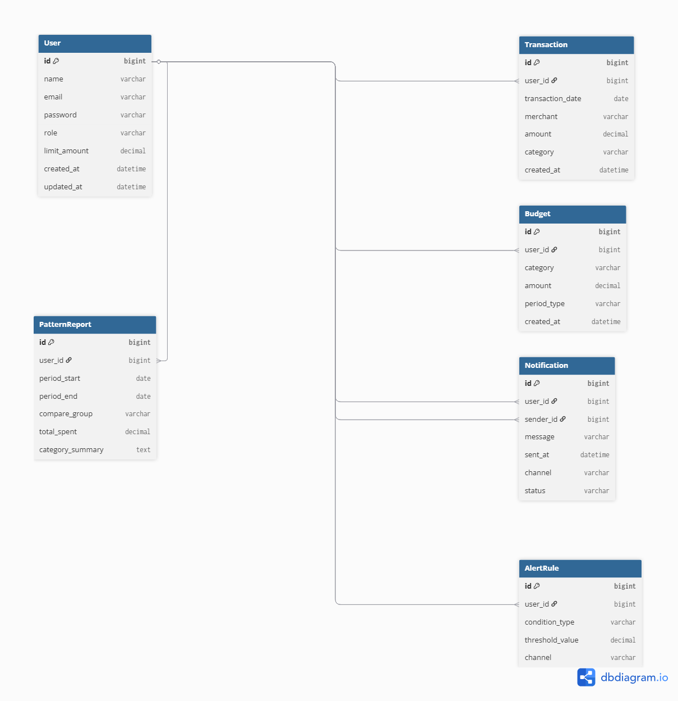

# 💳 신용카드 소비 분석 및 한도 초과 알림 서비스

---

## 1. 프로젝트 개요

- 사용자의 신용카드 사용 데이터를 등록하고 관리할 수 있는 백엔드 서비스입니다.
- 관리자 가 회원들의 지출 데이터를 모니터링하고 한도 초과/급등 시 알림을 발송합니다.
- 회원은 자신의 소비 데이터를 등록하고 주간/월간 리포트를 통해 패턴을 분석할 수 있습니다.
- 사용자가 설정한 한도/카테고리별 예산 대비 지출 상황을 모니터링할 수 있습니다.
- 한도 80% 이상 사용 시 스케줄러로 예상 초과 알림을 발송하며,
  실제 한도 초과 시 거래 등록과 동시에 실시간으로 알림을 발송합니다.
- 모든 알림은 Mailgun(이메일) 또는 SMS(Mock)를 통해 발송되며,
  발송 주체는 관리자 로 기록됩니다.
- 모든 데이터는 REST API + Swagger UI 로 테스트할 수 있습니다.

---

## 2. 핵심 역할 및 권한 (추가)

| 역할 | 설명 |
|------|------|
| **회원 (ROLE_USER)** | 개인 소비 데이터 등록/조회, 한도 설정, 리포트 확인 |
| **관리자 (ROLE_ADMIN)** | 회원 데이터 관리, 한도 초과/지출 급등 모니터링 및 알림 발송 |

---

## 3. 핵심 기능

| 번호 | 기능 | 설명 |
|------|------|------|
| 1 | 회원가입/로그인 | Spring Security + JWT 인증, ROLE_USER/ROLE_ADMIN 구분 |
| 2 | 거래 내역 등록/조회 | 회원은 거래일자, 사용처, 금액, 카테고리를 저장하고 조회 가능 |
| 3 | 소비 패턴 분석 | 주간 일자별 추이, 월간 주별 평균, 동일 집단 비교 |
| 4 | 카테고리별 소비 목표 | 회원이 카테고리별 목표 금액 설정 |
| 5 | 사용자별 한도 설정 | User.limit_amount 컬럼으로 관리 |
| 6 | 한도 초과/급등 알림 | 80% 이상 사용 시 스케줄러 알림, 초과 시 실시간 알림 (관리자 발송 주체) |
| 7 | Notification 기록 관리 | 알림 발송 이력 저장 (발송자: 관리자) |
| 8 | Swagger 기반 REST API | 모든 API 문서화 및 테스트 |

---

## 4. 서비스 동작 시나리오

1) 회원가입 시 역할 선택 (회원 또는 관리자)
2) JWT 인증을 통한 접근 제어
3) 회원은 거래 내역 등록 및 조회
4) 스케줄러가 한도 초과 예상 여부를 계산하고 관리자 권한으로 알림 발송
5) 거래 등록 시 실시간으로 한도 초과 여부 즉시 확인 → 관리자 권한으로 알림 발송
6) Notification 기록에 발송 주체(관리자)와 성공/실패 결과 저장
7) 리포트를 통해 주간/월간 소비 트렌드 확인

---

## 5. 알림 처리 구조 요약

| 구분 | 내용 | 처리 방식 | 발송 주체 |
|------|------|-----------|-----------|
| 예상 초과 알림 | 한도 80% 이상 사용 예상 | 스케줄러/배치 | 관리자 |
| 지출 급등 알림 | 하루 단위로 전일 대비 급등 여부 확인 | 스케줄러/배치 | 관리자 |
| 실시간 초과 알림 | 거래 등록 시 한도 초과 즉시 알림 | 비동기 이벤트 | 관리자 |
| 발송 채널 | Mailgun(이메일), SMS(Mock) | 외부 API 호출 | 관리자 |

---

## 6. ERD

| 테이블 | 주요 컬럼 | 설명 |
|--------|------------|------|
| User | id, name, email, password, limit_amount, role (User/Admin), created_at, updated_at | 회원/관리자 구분 |
| Transaction | id, user_id, transaction_date, merchant, amount, category, created_at | 회원 거래 내역 |
| Budget | id, user_id, category, amount, period_type, created_at | 회원별 소비 목표 |
| Notification | id, user_id (수신자), sender_id (발송자: 관리자), message, sent_at, channel, status | 알림 발송 이력 |
| PatternReport | id, user_id, period_start, period_end, compare_group, total_spent, category_summary | 소비 패턴 리포트 |
| AlertRule | id, user_id, condition_type, threshold_value, channel | 회원별 알림 조건 규칙 |

---

## 7. Trouble Shooting

- Mailgun 연동: 외부 SMTP 발송 실패 시 재시도 로직 적용
- 스케줄러/배치 처리 시점: 새벽 시간대 정기 실행, 지출 급등/한도 초과 여부 집계
- 실시간 알림 안정성: Mailgun/SMS 외부 API 비동기 처리로 실시간성 보장
- JWT 인증 문제: 토큰 만료 및 재발급 처리
- 관리자/회원 권한 분리: ROLE_ADMIN vs ROLE_USER 인가 로직 적용

---

## 8. Tech Stack

- **Backend:** Java 17+, Spring Boot 3.x, Spring Security, JWT
- **DB:** MySQL/MariaDB, H2(Test)
- **ORM:** Spring Data JPA, Hibernate
- **Batch/Scheduler:** Spring Scheduler/Batch
- **Notification:** Mailgun(이메일), SMS(Mock)
- **문서화:** Swagger UI
- **Test:** JUnit5, Testcontainers
- **배포:** Docker, AWS EC2+RDS, GitHub Actions(선택)

---
